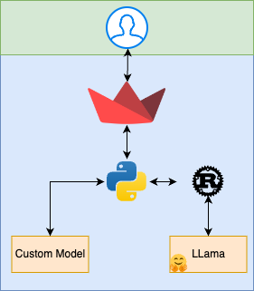

# Cloud Final Project

    

## Overview
In this project we make use of a custom pre-trained model and a open-source [Meta Llama](https://huggingface.co/meta-llama/Meta-Llama-3-8B) model to identify the food item present in the image and enable the user to ask questions about the food item. The front-end is built using [streamlit](https://streamlit.io/) and the back-end is built using [Python](https://www.python.org/) and [Rust](https://www.rust-lang.org/). The application is automatically containerized using [Docker](https://www.docker.com/) by Github Actions and deployed on [AWS](https://aws.amazon.com/) using services like ``ECR``, ``ECS``, ``S3`` and ``EC2`` (loadbalancer) with auto-scaling and monitoring. 

Link to App: [Link](http://cf-ecs-lb-162243208.us-east-2.elb.amazonaws.com/)

please watch this [Video](youtube.com) for a brief overview and demo of the project.

## Contents

## Instructions for using the app
Once you have accessed the app using the link provided above, you can follow the steps below to use the app:

1. **Access the App**: Visit our Streamlit app [here](http://cf-ecs-lb-162243208.us-east-2.elb.amazonaws.com/).

2. **Image Identification**:
    - In the `Image URL` field on the left sidebar, input the URL of an image featuring any of the listed food items.
    - Press `Enter` to initiate the identification process.
    - The app will analyze the image and display the identified food item.

3. **Question and Answer**:
    - If you have a question or prompt about the identified food item, input it in the `Enter your Query` field on the right.
    - Click on `Submit` to generate a response.
    - The app will use Huggingface's Llama LLM Model to generate and display a response to your query.

**Note**: The link needs to be a direct ``HTTPS`` link to the image and not a webpage containing the image, some links may not work as expected, Below are a few sample image URLs which have been tested and can be used to get started with the app:
- [Tiramisu](https://nourishingniki.com/wp-content/uploads/2022/05/Healthy-Tiramisu-3.jpg)
- [Tuna Tartare](https://whisperofyum.com/wp-content/uploads/2022/04/tuna-tartare-recipe.jpg)
- [Beet Salad](https://www.indianhealthyrecipes.com/wp-content/uploads/2021/04/beetroot-salad-recipe.jpg)
- [Fish and Chips](https://forkandtwist.com/wp-content/uploads/2021/04/IMG_0102-500x500.jpg)
- [Pancakes](https://mojo.generalmills.com/api/public/content/Pw6SBIgi-Ee6pTZBpU1oBg_gmi_hi_res_jpeg.jpeg?v=448d88d0&t=466b54bb264e48b199fc8e83ef1136b4)
- [Caesar Salad](https://assets.bonappetit.com/photos/624215f8a76f02a99b29518f/1:1/w_2800,h_2800,c_limit/0328-ceasar-salad-lede.jpg)
- [Garlic Bread](https://www.simplyrecipes.com/thmb/5JwdiUjcSPTxyuhmdqv8pM8kWs0=/1500x0/filters:no_upscale():max_bytes(150000):strip_icc()/Garlic-Bread-METHOD-2-3-1c5f5cfa8bf6408c84c0596eea83f8e8.jpg)
- [Carrot Cake](https://www.janespatisserie.com/wp-content/uploads/2015/08/CarrotCake3-scaled.jpg)
- [Chocolate Mousse](https://bakerbynature.com/wp-content/uploads/2023/08/Easy-Chocolate-Mousse-Baker-by-Nature-12636.jpg)
- [Hot Dog](https://www.brit.co/media-library/gourmet-hot-dogs.png?id=33770089&width=600&height=600&quality=90&coordinates=0%2C176%2C0%2C164)
- [Steak](https://jesspryles.com/wp-content/uploads/2020/04/untitled-2.jpg)

## App Development and Architecture

The app has three main components; The front-end, identification of the food item in the image and the query answering using the Meta Llama model. 

### Frontend
The user interface is built using Streamlit, a Python library that allows for rapid prototyping and deployment of data applications. This abstracts away the complexity of developing a web application and allows for quick development and deployment and works well with python.

### Food Item Identification
The first task of the app is to identify the food item which is present in the image so that this information can be passed on to the LLM to give it more context. For this task, we used our own model which we made for another project, for additional information on the model and how it was trained, please refer to the [model repository](https://github.com/nogibjj/ML_Final). The model was trained to identify only 11 classes of food items since this was for demonstration purpose and it helps in keeping the size of the model relatively small.

When the image link is passed by the user, the python backend downloads the image and performs pre-processing operations on it so that it can be passed to the model. The model then predicts the class of the food item which is shown to the user and stored in the backend for further use.

### Question and Answer
Once the food item is identified, the user can ask questions about the food item, the python takes in this query and combines it with the earlier odentified food item and passes it to the Rust application. 

In the rust application, further processing of the text is performed, 
## CI/CD Pipeline

## App Deployment

## Monitoring and Logging

## Team Members
Please feel free to reach out to any of us with questions or comments
-   [Divya Sharma (ds655)](https://github.com/DivyaSharma0795)
-   [Faraz Jawed (fj49)](https://github.com/farazjawedd)
-   [Revanth Chowdary Ganga (rg361)](https://github.com/revanth7667)
-   [Udyan Sachdev (us26)](https://github.com/udyansachdev1)
